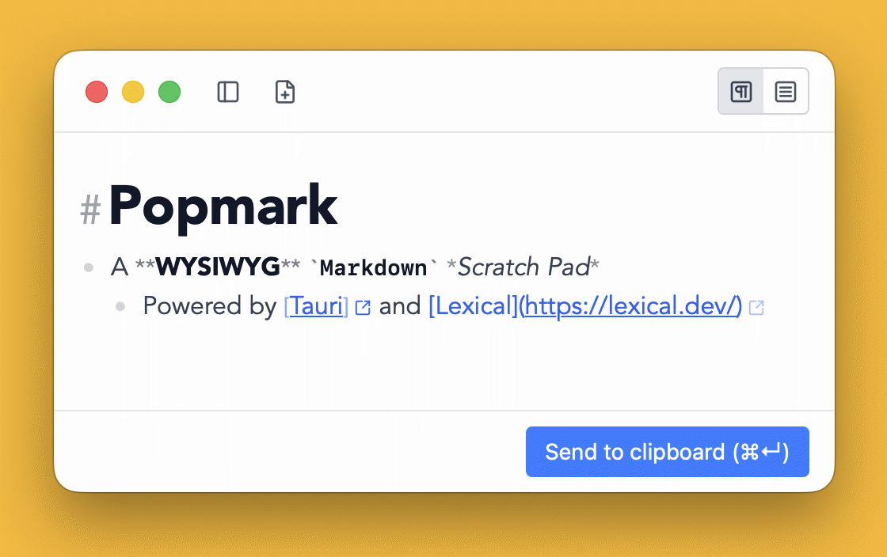

# Popmark

Press a hotkey, write your Markdown, send to clipboard, done.



## Background

AI chat tools and agents often have cramped Markdown input fields, and key assignments for newline vs. send vary between tools (Shift+Enter, Cmd+Enter, Enter…) — one wrong keystroke sends a half-finished message. I wanted a calm, spacious place to compose without that anxiety.

Beyond that, I frequently need quick personal notes that auto-save themselves. No filename prompt, no save dialog, no folder to choose — just write and move on.

I also have a preference for source-visible WYSIWYG Markdown editors (the kind where `**bold**` renders bold but the asterisks stay visible). Popmark is what I built for myself.

## Features

- **Two editing modes** — Rich (source-visible WYSIWYG, Obsidian-style) and Plain text; toggle with ⌘⇧R / ⌘⇧P
- **Send to Clipboard** — copies content as Markdown and hides the window in one keystroke (⌘↩ by default)
- **Copy as rich text** — optionally copies rendered HTML alongside plain Markdown so formatting is preserved when pasting into apps that support it
- **Auto-save draft** — your work is never lost; the editor restores exactly where you left off
- **History** — every clipboard send is saved and accessible from the side panel
- **Export** — save the current document as a `.md` file at any time (⌘S)
- **Global hotkey** — show or hide the editor from anywhere, even when the app is in the background
- **Launch at login** — always ready, zero friction
- **Notification on copy** — optional OS notification after each send (configurable)
- **Font customization** — set font family and size independently for Rich and Plain modes

## Installation

### Homebrew (recommended)

```sh
brew install --cask dayflower/tap/popmark
```

### Direct download

Download the latest `.dmg` or `.zip` from [GitHub Releases](https://github.com/dayflower/popmark/releases) and drag Popmark to `/Applications`.

### Gatekeeper caveat

Popmark is signed ad-hoc (no Apple Developer certificate), so macOS Gatekeeper will block it on first launch. To open it anyway, either:

- Right-click (or Control-click) `Popmark.app` → **Open** → confirm the dialog, or
- Run the following in Terminal:

  ```sh
  xattr -dr com.apple.quarantine /Applications/Popmark.app
  ```

> Popmark is built on [Tauri](https://tauri.app), so it can be compiled for Linux and Windows as well — but only macOS binaries are officially distributed.

## How to Use

1. Press the global hotkey (default **⌥M**) — the editor appears.
2. Write your Markdown.
3. Press **⌘↩** (or click "Send to clipboard") — content is copied to the clipboard and the window hides.
4. Paste wherever you need it.

The editor window can also be opened from the menu-bar tray icon or the Dock icon.

## Keyboard Shortcuts

| Shortcut | Action |
|----------|--------|
| ⌥M (default) | Show / hide the editor window (global) |
| ⌘↩ (default) | Send to Clipboard and hide |
| ⌘N | New document (auto-saves current draft to history) |
| ⌘S | Export as `.md` file |
| ⌘⇧R | Switch to Rich mode |
| ⌘⇧P | Switch to Plain mode |
| ⌘H | Open / close History panel |
| Esc | Hide the editor window |

> Both the global hotkey and the Send to Clipboard shortcut can be changed in Settings.

## Settings

Open Settings from the tray icon menu or the app menu (⌘,).

| Setting | Description |
|---------|-------------|
| Global hotkey | Key combination to show / hide the editor window |
| Send to Clipboard shortcut | Key combination to trigger "Send to Clipboard" inside the editor (default: `⌘↩`) |
| Launch at login | Start Popmark automatically when you log in |
| Editor mode | Default mode: Rich (source-visible WYSIWYG) or Plain (raw Markdown) |
| Copy as rich text | Also copy rendered HTML so formatting survives pasting into rich-text apps (Rich mode only) |
| Notify on copy | Show an OS notification after each "Send to Clipboard" |
| Max history entries | Cap on saved history items; oldest are pruned automatically (0 = unlimited) |
| Font family & size | Custom font for Rich mode and Plain mode, configured independently |

## Supported Markdown

Headings (H1–H6), **bold**, _italic_, **_bold italic_**, ~~strikethrough~~, `inline code`, fenced code blocks, blockquotes, unordered and ordered lists, task lists (`- [ ]` / `- [x]`), horizontal rules, and links.

## License

MIT — see [LICENSE](LICENSE) for details.
